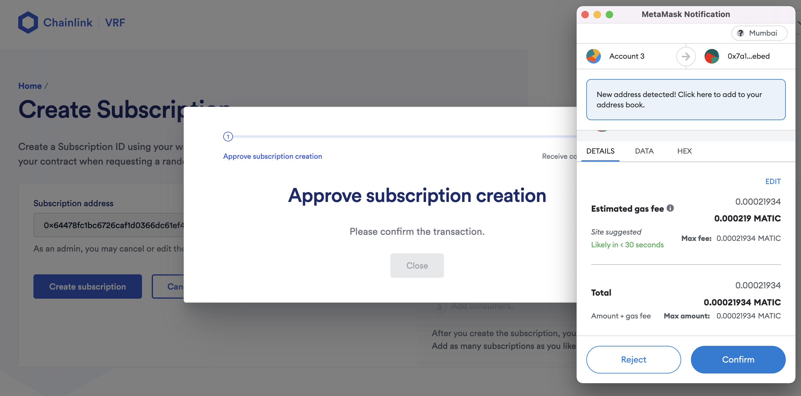
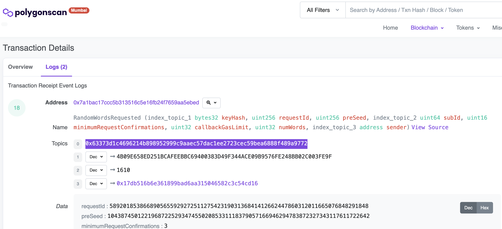
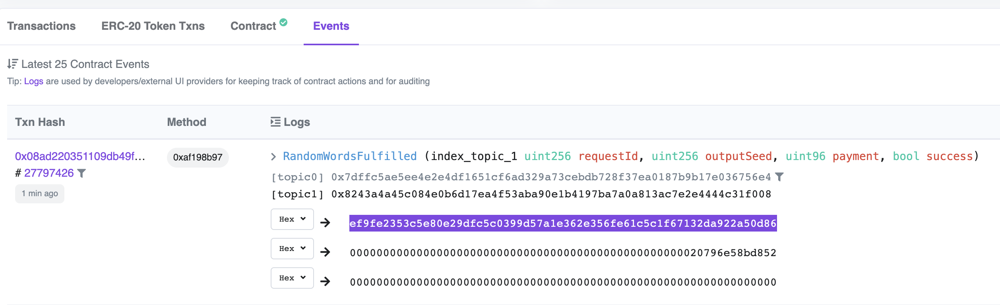

## Integration

You can do integration test in contracts package

run following.

```
yarn hardhat test --network mumbai
```

### Setup subscription



### Setup Fund


### Add Consumer

This is achieved by program, because we are building launchpad

### Request



### Fulfill


