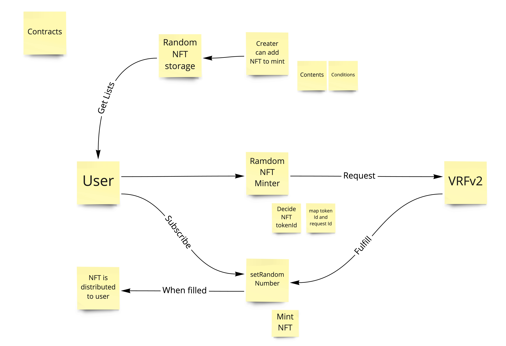
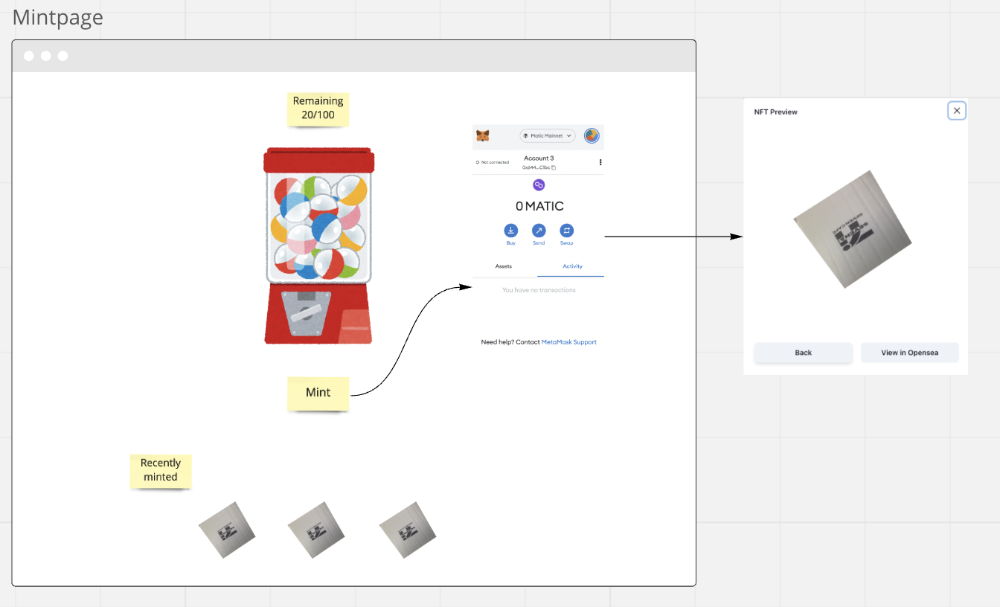
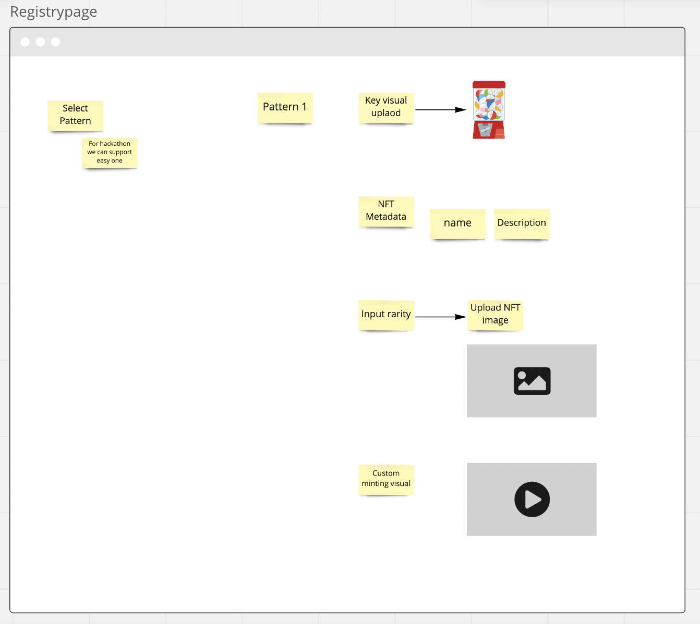
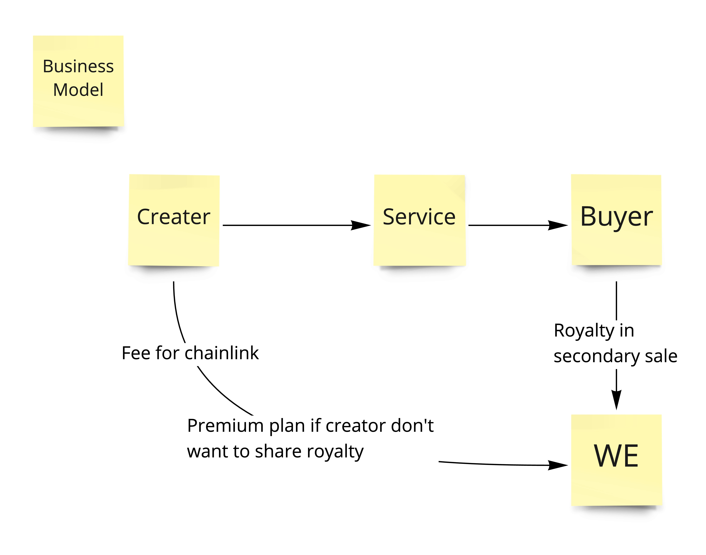

# NFTDoor

NFTDoor is dynamic NFT launchpad powered by Chainlink VRF v2, creators can create and sell dynamic NFT very easily.

## Inspiration

[Aavegocchi as Dynamic NFT](https://chain.link/case-studies/aavegotchi)

[NFTLaunch as NFT Launchpad](https://www.nftlaunch.network/)

## Demo

[Deployed App](https://nftdoor.vercel.app/)

[Demo Video](https://youtu.be/9U8TD6t031I)

[Google Slide](https://docs.google.com/presentation/d/12u0J9Wr-N4e5BYRuOOCwn_u21WbIp6RpJr2rqBDa7F8)

## Technical Detail

[Technical Detail is kept here](./TECHNICAL_DETAIL.md)

## Chainlink Integration

[Chainlink Integration is kept here](./CHAINLINK_INTEGRATION.md)

## Tx

[Callback Tx with minting](https://mumbai.polygonscan.com/tx/0xc6065f492b275ef2083ddd1840bcbb371c81276620db2bdd0ee66aa3f58f2365)

## Contract

We implement twe contracts

- Dynamic NFT Minter
- Dynamic NFT Registry

### Dynamic NFT Minter

- buying user can request minting NFT

  - this process calls request random number to Chainlink VRF v2

- Chainlink VRF v2 can send call back

  - this process mint NFT to buying user

### Dynamic NFT Registry

- define rarity condition
- it stores NFT metadata to each rarity

* this part may move to server less function

## Frontend

this is mock frontend, these pictures replaced when implemented

## Business Model

## Packages

We are working in team, so devide package to work and define output

### App

This part is going to be implemented via Nextjs,

- Expected output

  - Working frontend and serverless functions code

  - Should be deployed so that users can try it out

### Contracts

- Expected output

  - Should be deployed to Chainlink VRFv2 available network

  - Contract address and ABI to access it from frontend

  - Unit testing if possible
